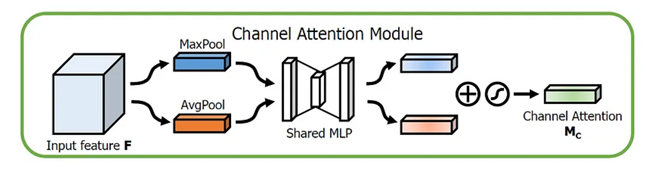
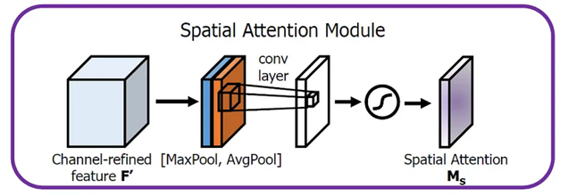

# Facial Emotion Recognition using Deep Learning

This project focuses on the development of a Facial Emotion Recognition (FER) system using deep learning techniques.  
Two complementary models were designed and compared:

1. A **custom Convolutional Neural Network (CBAM-5CNN)** built entirely from scratch and integrated with an **attention mechanism (CBAM)**.  
2. A **pretrained EfficientNetB3 model** fine-tuned on a curated facial emotion dataset.

The goal is to classify human facial expressions into seven emotions: Angry, Disgust, Fear, Happy, Sad, Surprise, and Neutral.

---

## 1. Project Overview

Facial Emotion Recognition (FER) is an important field within artificial intelligence and computer vision.  
It aims to identify human emotions through facial expressions, contributing to areas such as affective computing, healthcare, social robotics, and human-computer interaction.

This project investigates two deep learning approaches:
- A **from-scratch architecture** designed to be interpretable, lightweight, and efficient (_CBAM-5CNN_).  
- A **transfer learning approach** (_EfficientNetB3_) designed to maximize accuracy and robustness.

Both models were trained, validated, and evaluated on an enhanced dataset named **FER2024_CK+**, which combines cleaned FER2013 images and the high-quality CK+ dataset.

---

## 2. Objectives

- Develop and train deep learning models to automatically detect and classify facial emotions.  
- Compare the performance of a pretrained model versus a custom-built CNN.  
- Improve dataset quality through cleaning, relabeling, and augmentation.  
- Integrate attention mechanisms to enhance model focus on key facial features.  
- Evaluate model performance using quantitative metrics and visual analysis.  
- Explore the potential for real-time emotion recognition applications.

---

## 3. Dataset Description

| Dataset | Description | Images | Emotions | Source |
|----------|--------------|---------|-----------|---------|
| FER2013 | Grayscale facial expression dataset with seven emotion categories (48x48). | 35,887 | 7 | [FER2013 Dataset](https://www.kaggle.com/datasets/msambare/fer2013) |
| FER2024 | Cleaned and relabeled version of FER2013. | 35,784 | 10 | [FER 2024 Dataset](https://github.com/FERProject/FER24_CKPlus/releases/tag/FER24_CK%2B) |
| CK+ | High-quality dataset used for benchmarking facial expression recognition. | 920 | 7 | [CK+ Dataset](https://www.kaggle.com/datasets/shuvoalok/ck-dataset) |

### Sample Images

<figure>
  
  <figcaption><em>Figure 1:</em> Sample images from FER2013 dataset showing various facial expressions.</figcaption>
</figure>

<figure>
  
  <figcaption><em>Figure 2:</em> Enhanced FER2024 dataset samples with corrected labels and additional diversity.</figcaption>
</figure>

<figure>
  
  <figcaption><em>Figure 3:</em> High-quality facial expression images from the CK+ dataset for benchmarking.</figcaption>
</figure>

---
**Final dataset used:** FER2024_CK+ (7 emotions)
---

## 4. Data Augmentation

Data augmentation was applied to increase dataset variability and prevent overfitting.  
The `ImageDataGenerator` from Keras was used:

```python
from tensorflow.keras.preprocessing.image import ImageDataGenerator

train_datagen = ImageDataGenerator(
    rescale=1./255,
    rotation_range=30,
    width_shift_range=0.2,
    height_shift_range=0.2,
    brightness_range=[0.8, 1.2],
    shear_range=0.2,
    zoom_range=0.2,
    horizontal_flip=True
)
```
---
## 5. Model Architectures

### 5.1 CBAM-5CNN (Model Built from Scratch)

#### Architecture Details

| Block   | Layers                               | Filters | Description                        |
|---------|-------------------------------------|---------|------------------------------------|
| Block 1 | Conv2D + BatchNorm + CBAM + MaxPooling + Dropout | 64      | Low-level edge extraction           |
| Block 2 | Conv2D + BatchNorm + CBAM + MaxPooling | 128     | Mid-level pattern recognition       |
| Block 3 | Conv2D ×3 + CBAM                     | 256     | Emotion-related feature extraction  |
| Block 4 | Conv2D ×3 + CBAM                     | 512     | High-level facial representation    |
| Block 5 | Conv2D ×3 + CBAM                     | 512     | Focus refinement                    |
| Dense   | Flatten + Dense(7, Softmax)          | -       | Final emotion classification        |

#### Attention Mechanism (CBAM)

- **Channel Attention:** Learns to emphasize important feature maps across channels.  
- **Spatial Attention:** Highlights significant facial regions such as eyes, eyebrows, and mouth.  
- **Activation Functions:** ReLU for non-linearity and Sigmoid for attention scaling.

<figure>
  
  <figcaption><em>Figure 4:</em> CBAM-5CNN architecture illustrating convolutional blocks and attention mechanisms.</figcaption>
</figure>

<figure>
  
  <figcaption><em>Figure 5:</em> Channel Attention map highlighting the most informative feature channels.</figcaption>
</figure>

<figure>
  
  <figcaption><em>Figure 6:</em> Spatial Attention map focusing on key facial regions like eyes, eyebrows, and mouth.</figcaption>
</figure>

#### Training Configuration

- Optimizer: Adam (learning rate = 0.0001)  
- Loss Function: Categorical Crossentropy  
- Regularization: Dropout, BatchNormalization  
- Callbacks: EarlyStopping, ReduceLROnPlateau  
- Metrics: Accuracy, Precision, Recall

#### Results

| Metric    | Training | Validation |
|-----------|----------|------------|
| Accuracy  | 80.55%   | 78.9%      |
| Precision | 84.31%   | 81.0%      |
| Recall    | 77.09%   | 75.4%      |

<figure>
  
  <figcaption><em>Figure 7:</em> Training and validation accuracy curves for CBAM-5CNN model.</figcaption>
</figure>

<figure>
  
  <figcaption><em>Figure 8:</em> Training and validation loss curves for CBAM-5CNN model.</figcaption>
</figure>

<figure>
  
  <figcaption><em>Figure 9:</em> Confusion matrix of CBAM-5CNN predictions across seven emotions.</figcaption>
</figure>

---

### 5.2 EfficientNetB3 (Pretrained Model)

#### Architecture Adaptation

- Base model: EfficientNetB3 (include_top=False)  
- Added layers:  
  - GlobalAveragePooling2D  
  - Dense(256, activation='relu')  
  - Dropout(0.4)  
  - Dense(7, activation='softmax')  
- Fine-tuned the last 50 layers with a reduced learning rate (1e-5).

<figure>
  
  <figcaption><em>Figure 10:</em> EfficientNetB3 architecture used with transfer learning for facial emotion recognition.</figcaption>
</figure>

#### Training Configuration

- Optimizer: Adam (learning rate = 1e-5)  
- Loss Function: Categorical Crossentropy  
- Batch Size: 32  
- Epochs: 30  
- Callbacks: EarlyStopping, ModelCheckpoint, ReduceLROnPlateau

#### Results

| Metric    | Training | Validation |
|-----------|----------|------------|
| Accuracy  | 86.7%    | 83.7%      |
| Precision | 87.5%    | 86.1%      |
| Recall    | 84.8%    | 82.5%      |

<figure>
  
  <figcaption><em>Figure 11:</em> Training and validation accuracy curves for EfficientNetB3 model. [Source]</figcaption>
</figure>

<figure>
  
  <figcaption><em>Figure 12:</em> Training and validation loss curves for EfficientNetB3 model.</figcaption>
</figure>

<figure>
  
  <figcaption><em>Figure 13:</em> Confusion matrix of EfficientNetB3 predictions across seven emotions.</figcaption>
</figure>

---

## 6. Comparative Analysis

| Model         | Accuracy | Precision | Recall | F1-Score |
|---------------|----------|-----------|--------|----------|
| CBAM-5CNN     | 80.55%   | 84.31%    | 77.09% | 80.0%    |
| EfficientNetB3| 83.7%    | 86.1%     | 82.5%  | 84.3%    |

<figure>
  
  <figcaption><em>Figure 14:</em> Sample test results of EfficientNetB3 showing correct emotion predictions.</figcaption>
</figure>

<figure>
  
  <figcaption><em>Figure 15:</em> Sample test results of CBAM-5CNN showing correct emotion predictions.</figcaption>
</figure>

### Observations

- EfficientNetB3 achieved higher overall accuracy and stability.  
- The CBAM-5CNN model provided better interpretability and was computationally efficient.  
- Both models performed well, particularly for emotions such as Happy and Neutral.  
- Some misclassifications occurred between similar emotions (Fear vs Surprise).

---

### Feedback

For any inquiries, feedback, or to discuss this project further, please do not hesitate to reach out.

---

### References

1. [EfficientNet: Optimizing Deep Learning Efficiency, OpenGenus IQ](https://iq.opengenus.org/efficientnet/)  
2. [EfficientNet: Optimizing Deep Learning Efficiency, Viso.ai](https://viso.ai/)  
3. [EfficientNet-B3, Scribd](https://fr.scribd.com/document/638261928/EfficientNet-B3)  
4. [Inverted Residual Block, Serp.ai](https://serp.ai/inverted-residual-block/)  
5. [Squeeze and Excitation Networks, Arxiv.org](https://arxiv.org/pdf/1709.01507)  
6. [Squeeze and Excitation Networks, Medium](https://medium.com/@Vinoth-Ramadoss/squeeze-and-excitation-networks-84e3db0e04e2)  
7. [Complete Architectural Details of All EfficientNet Models, Towards Data Science](https://towardsdatascience.com/complete-architectural-details-of-all-efficientnet-models-5fd5b736142)  
8. [Understanding Attention Modules: CBAM and BAM, Medium](https://medium.com/visionwizard/understanding-attention-modules-cbam-and-bam-a-quick-read-ca8678d1c671)  
9. [Remote Sensing and Attention Modules, MDPI](https://www.mdpi.com/2072-4292/15/9/2406)  
10. [Early Stopping to Avoid Overtraining Neural Network Models, Machine Learning Mastery](https://machinelearningmastery.com/early-stopping-to-avoid-overtraining-neural-network-models/)  
11. [Early Stopping for Regularisation in Deep Learning, GeeksforGeeks](https://www.geeksforgeeks.org/early-stopping-for-regularisation-in-deep-learning/)  
12. [ReduceLROnPlateau - TensorFlow Python, W3cubDocs](https://tf.keras.callbacks.ReduceLROnPlateau)  
13. [Data Augmentation: Tout Savoir, DataScientest](https://datascientest.com/data-augmentation-tout-savoir)  
14. [Complete Guide to Data Augmentation, DataCamp](https://www.datacamp.com/tutorial/complete-guide-data-augmentation)  
15. [Data Augmentation Techniques in CNN Using TensorFlow, Medium](https://medium.com/ymedialabs-innovation/data-augmentation-techniques-in-cnn-using-tensorflow-371ae43d5be9)  
